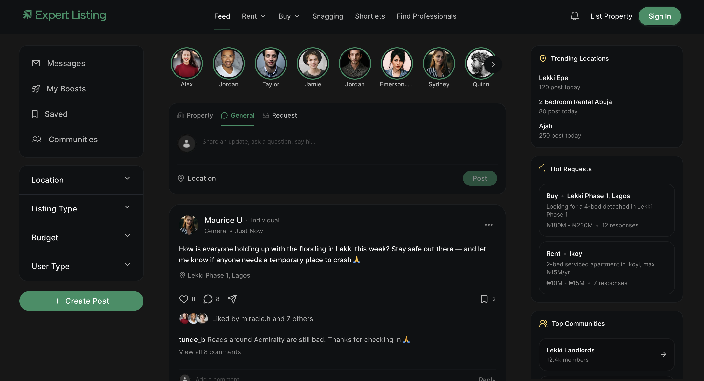
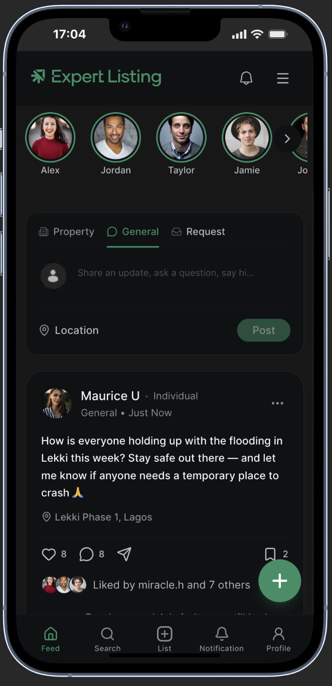

# Proptech Social Feed (Expert Listing)

A modern, highly responsive proptech social feed application built as part of a Frontend Software Engineering assessment. The project replicates a detailed Figma specification, emphasizing performance, clean typography, and a seamless infinite scroll experience.

## Live Demo & Previews

- **Live URL:** [https://proptech-feed.vercel.app/](https://proptech-feed.vercel.app/)

### Visual Demonstration
Below are visual previews of the application layout across desktop and mobile devices:

#### Desktop Interface


#### Mobile Interface & Interaction Demo
Here is the mobile layout view along with a recorded demonstration showcasing the infinite scroll loading, category filtering, and sticky header behaviors:

| Mobile View | Interaction Recording |
|---|---|
|  |  |

---

## Tech Stack

The application was built using a modern, scalable frontend stack:

- **Framework:** Next.js (v16.2.9) utilizing the App Router and Turbopack for lightning-fast builds
- **Language:** TypeScript for strict static typing and clean interface declarations
- **State & Query Management:** TanStack React Query (v5) for robust caching, fetching, and infinite-scroll state synchronization
- **Styling:** Tailwind CSS (v4) for CSS-first utility styling and design token integration
- **Component Primitives:** Shadcn/UI & Radix UI for accessible, unstyled foundation components
- **Animations:** Framer Motion (v12) & tw-animate-css for micro-interactions and transitions
- **Scroll Detection:** React Intersection Observer for viewport triggers

---

## Getting Started

To run the project locally, install dependencies and start the development server:

```bash
# Install dependencies
npm install

# Run the development server
npm run dev
```
Open [http://localhost:3000](http://localhost:3000) in your browser to view the application.

---

## Technical Decisions

### Why TanStack Query
I integrated **TanStack Query** (v5) to handle client-side data fetching, state caching, and infinite scroll pagination. 
- **Server State Management:** Instead of writing complex `useEffect` state syncing or global React Context, TanStack Query provides a robust container for handling loading, error, and fetching states out-of-the-box.
- **Infinite Queries:** Using `useInfiniteQuery` allowed me to abstract away manual index keeping, fetching nextPage parameters, and managing cached page arrays. It significantly keeps components clean and focused.

### Why React Intersection Observer
To trigger the next page request during scrolling, I implemented **React Intersection Observer** rather than custom scroll event listeners.
- **Performance Optimization:** Scroll event listeners run on the main thread and require debouncing or throttling to avoid page lag. By using the browser's native `IntersectionObserver` API via `useInView`, this offloads scroll detection to a separate thread, resulting in 60fps scrolling.
- **Developer Experience:** It allows me to define a simple invisible trigger element at the bottom of the feed and react immediately when it enters the viewport.

### Why Shadcn/UI & Tailwind CSS v4
The visual design of the feed requires specific UI patterns (buttons, inputs, skeleton cards). I used **Shadcn/UI** as my baseline component set.
- **High Customizability:** Unlike rigid component libraries, Shadcn/UI provides utility-first components that live directly in the codebase.
- **Tailwind CSS v4 Integration:** I used the newly released Tailwind CSS v4, which moves configuration into a modern CSS-first paradigm. This allowed me to write custom utility overrides without maintaining a heavy JS configuration file.

### Why a Mock API
To replicate a production-ready client-server architecture, I built a Next.js API route (`/api/posts/route.ts`).
- **Paginated Mock Feed:** The mock database resides in `src/lib/mock-data.ts`. It includes high-fidelity handcrafted posts and generates an additional 500 records programmatically. This ensures you can scroll indefinitely to evaluate performance.
- **Visual Validation (Simulated Latency):** I introduced a deliberate `800ms` delay on API requests. This gives the reviewer an opportunity to observe the loading skeleton components and ensures the interface transitions smoothly.

---

## Design System & Assets

### Local Font Integration (Open Runde)
To achieve the exact typographic aesthetic of the Figma design, the **Open Runde** font family was integrated locally.
- I used Next.js's font optimization (`next/font/local`) to load `.woff` formats (Regular, Medium, Semibold, and Bold).
- The font is mapped to the `--font-open-runde` CSS variable and declared as the default sans-serif font in Tailwind CSS. This prevents layout shifts (CLS) and ensures immediate, optimized text rendering on load.

### Design Tokens & Theme Variables
Rather than scattering hardcoded hex values across the stylesheet, I declared a structured color and spacing hierarchy in `src/app/globals.css`:
- Design values (backgrounds, borders, brand greens, and badges) are defined as semantic CSS variables under `:root` and `@theme inline`.
- This ensures consistency (e.g., matching the exact brand green `#2f8f63`) and ensures the project is easy to maintain or theme in the future.

### Visual Assets (Unsplash)
All property listing images and user avatars are sourced from **Unsplash**.
- Sourcing realistic, high-quality architectural photography and professional user avatars ensures the feed feels like a premium social platform.
- It elevates the presentation of the assessment, making it easier for evaluators to judge visual alignment and layout symmetry under realistic content constraints.

### Icon Implementation (Figma SVGs & Lucide Fallbacks)
- **Figma SVG Exports:** Key brand assets—such as the "Expert Listing" logo, notification bell, chat bubble, bookmark, and hot badge—were exported directly from the Figma design as SVGs and exported through `src/assets/index.ts`.
- **Lucide Fallbacks:** In a few instances, exported SVGs from Figma rendered incorrectly (e.g., path distortion, misaligned layers, or missing curves). To preserve a polished interface, I substituted these with matching icons from `lucide-react` (like `MapPin`, `ChevronDown`, `Heart`, and `Tag`). This ensures consistent rendering across all viewports.

---

## Architecture & Code Structure

The project follows a standard Next.js App Router structure:

```
src/
├── app/                  # Next.js page layouts, global CSS, and API endpoints
│   ├── api/posts/        # Mock API route handling pagination
│   └── globals.css       # CSS theme tokens & Tailwind directives
├── assets/               # Exported Figma SVGs & local profile images
├── components/           # Reusable UI and Layout components
│   ├── layout/           # Global structures (Navbar, Sidebars)
│   │   ├── feed/         # Feed logic (FeedSection, PostCard, Stories)
│   │   ├── navbar/       # Desktop Header & Mobile navigation
│   │   └── sidebar/      # Left/Right structural panels
│   └── ui/               # Base Shadcn primitive elements (Button, Skeleton, etc.)
├── fonts/                # Local Open Runde WOFF assets & config
├── lib/                  # Utility functions & local database mockup
└── types/                # Strict TypeScript interfaces
```

---

## Evaluation Highlights for Reviewers

- **Clean Scrolling:** Scroll down to watch the loading skeletons fetch and append posts smoothly.
- **Dynamic Category Filtering:** Toggle between feed categories in the navigation header or sidebars. The API route updates dynamically, and TanStack Query handles caching and state caching seamlessly.
- **Responsive Layout:** The application transitions from a multi-column desktop layout (with active navigation hover states) to a mobile-optimized view with a sticky header and navigation bars.
